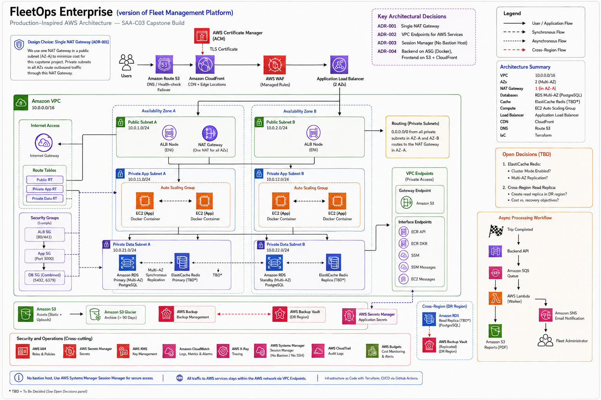
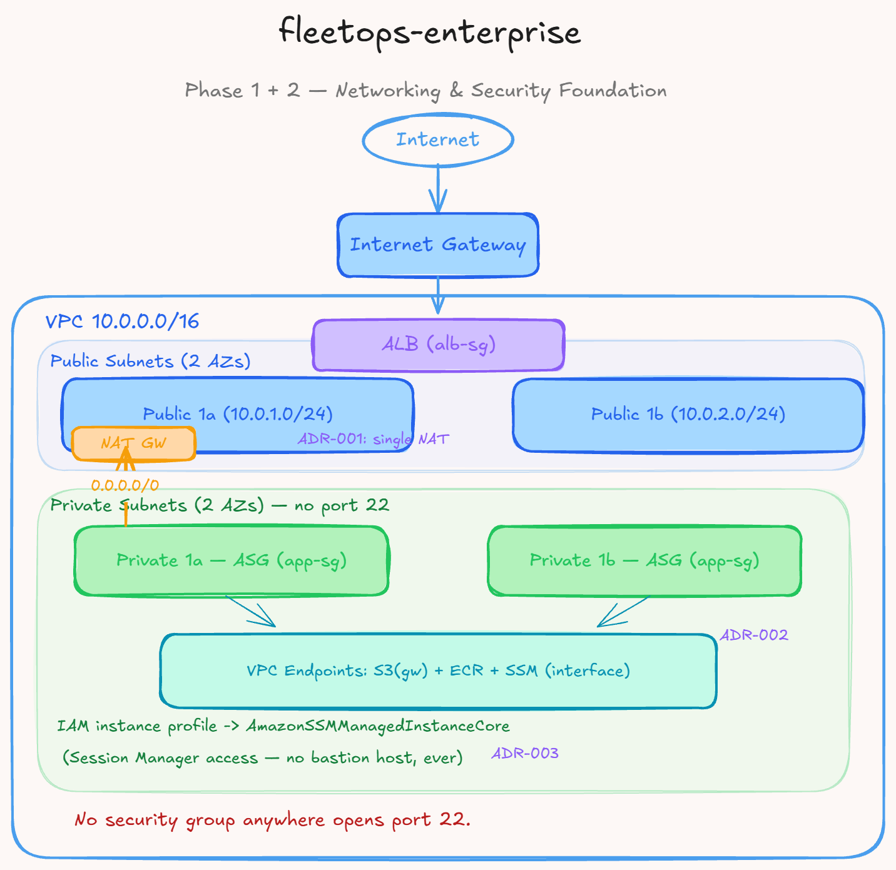
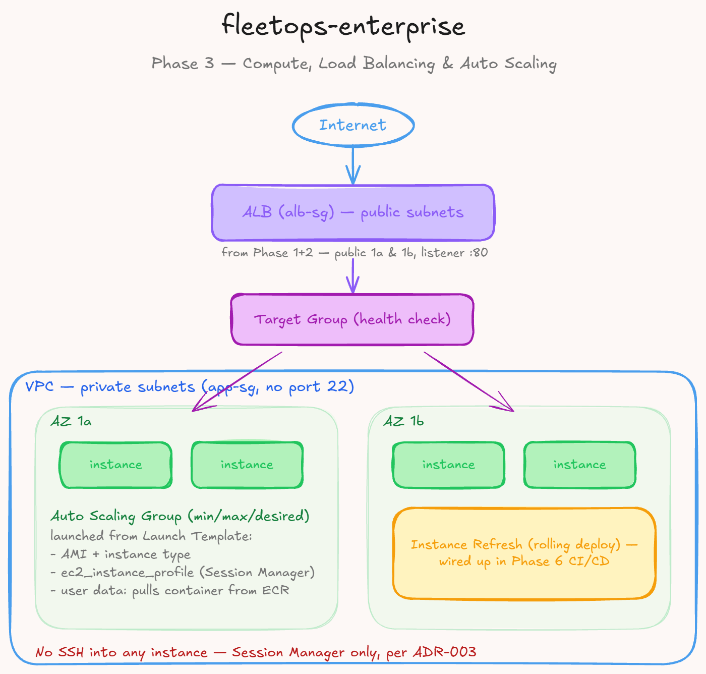
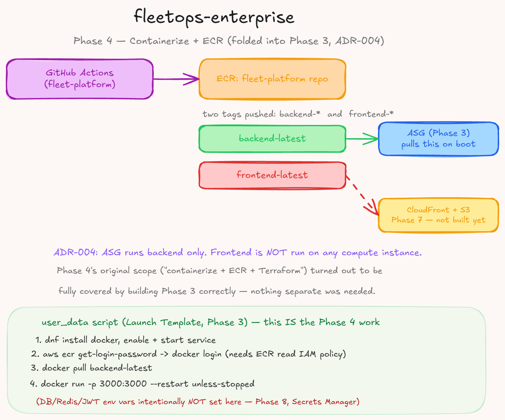
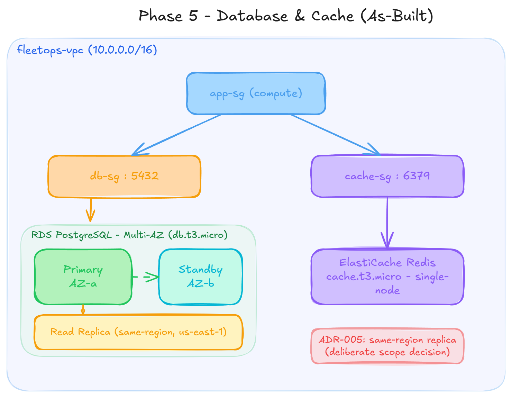

# 🚚 FleetOps Enterprise


Production-grade AWS infrastructure for Fleet Platform's trip-completion
reporting feature — an 11-phase capstone designed for AWS SAA-C03 prep and
DevOps/Cloud portfolio work.

> This project extends the Fleet Platform application layer with resilient,
> production-grade infrastructure spanning networking, data resiliency,
> event-driven reporting, edge protection, and observability.

---

## 💡 Why this project matters

When a trip transitions to `completed`, an asynchronous pipeline generates a PDF
report covering fuel usage, route summary, driver performance, and maintenance
flags, then notifies the fleet admin. Nearly every service in this architecture
exists to support that one business flow.

---

## ✅ Current state

**Phases 1–5 are implemented, applied, and verified end-to-end** — not just
provisioned, but confirmed working. As of the latest apply, the backend
returns a live `200 OK` from `/api/health`, connected to a real RDS Multi-AZ
database and ElastiCache Redis instance, with application secrets injected at
boot via Secrets Manager. This is the first point in the project where the
full stack — networking, security, compute, and data — is not just deployed
but functionally correct.

Phases 6–11 continue as progressive enhancements: storage lifecycle policies,
edge delivery, secrets/parameter hardening, monitoring, event-driven
reporting, and backup/DR.

---

## 📚 Documentation hub

The [docs/decisions](docs/decisions) folder holds the architectural decision
records (ADRs) for the major choices behind this platform — the reasoning,
trade-offs, and rejected alternatives behind each one, not just the final
design.

| ADR | Title |
|-----|-------|
| [ADR-001](docs/decisions/adr-001-single-nat-gateway.md) | Single NAT Gateway |
| [ADR-002](docs/decisions/adr-002-vpc-endpoints-not-nat.md) | VPC Endpoints Instead of NAT Routing |
| [ADR-003](docs/decisions/adr-003-session-manager-not-bastion.md) | Session Manager Instead of a Bastion Host |
| [ADR-004](docs/decisions/adr-004-backend-compute-only-phase4.md) | ASG Runs Backend Only; Frontend Deferred to S3 + CloudFront |
| [ADR-005](docs/decisions/adr-005-data-layer-architecture.md) | Data Layer Architecture — RDS Multi-AZ, Same-Region Replica, ElastiCache, Split Security Groups |
| [ADR-006](docs/decisions/adr-006-secret-injection-at-boot.md) | Secrets and Runtime Configuration Injection at Boot |

---

## 🏗️ Architecture at a glance



### ✨ Architecture highlights

- 🌐 **Networking** — VPC, public/private subnets across 2 AZs, IGW, single
  NAT Gateway, and VPC Endpoints for S3, ECR, and SSM
- 🔒 **Security** — layered security groups (ALB → app → data tier), IAM
  least privilege, no bastion host, no port 22 anywhere
- 🖥️ **Compute** — Launch Template, Auto Scaling Group, Application Load
  Balancer, Docker on Amazon Linux 2023, images from ECR
- 🗄️ **Data** — RDS PostgreSQL Multi-AZ with a same-region read replica,
  ElastiCache Redis (single-node), S3 with Glacier lifecycle policies
- 🔑 **Secrets** — AWS Secrets Manager for both database credentials and
  application (JWT) secrets, fetched at instance boot via IAM role, never
  hardcoded or committed
- 📡 **Edge/DNS** *(planned)* — Route 53 failover health checks, ACM,
  CloudFront, and WAF
- 📨 **Event-driven** *(planned)* — SQS → Lambda → S3 for reports, SNS for
  notifications
- 📊 **Monitoring** *(planned)* — CloudWatch, X-Ray, Prometheus, and Grafana
- 💾 **Backup/DR** *(planned)* — AWS Backup, cross-region snapshot copy,
  documented RPO/RTO
- 💰 **Cost & delivery** *(planned)* — AWS Budgets, tagging, GitHub Actions,
  Terraform, and ASG Instance Refresh pipelines

### Diagram gallery

- 
- 
- 
- 

---

## 🔧 Build method

Console-first for genuinely new services (networking, RDS, WAF) to build
real understanding before automating; straight to Terraform for services
already built once before in this project. AWS CLI validates every layer
before Terraform apply, and Terraform-managed state is the final source of
truth for each phase. Every non-trivial trade-off is written up as an ADR —
including ones caught and corrected before they shipped, not just the ones
that went right the first time.

---

## 🧭 Phase tracker

| Phase | Scope | Status |
|-------|-------|--------|
| 1 | Networking foundation | ✅ Complete |
| 2 | Security foundation (SGs, IAM, Session Manager) | ✅ Complete |
| 3 | Compute + ALB + ASG | ✅ Complete |
| 4 | Containerize + ECR + Terraform | ✅ Complete — folded into Phase 3 ([ADR-004](docs/decisions/adr-004-asg-backend-only.md)) |
| 5 | RDS Multi-AZ + read replica + ElastiCache | ✅ Complete ([ADR-005](docs/decisions/adr-005-data-layer-architecture.md)) |
| 5b | Secrets injection & runtime config at boot | ✅ Complete ([ADR-006](docs/decisions/adr-006-secrets-injection-at-boot.md)) — app confirmed live, `200 OK` from `/api/health` |
| 6 | S3 + lifecycle policies | ⏳ Planned |
| 7 | Route 53 + ACM + CloudFront | ⏳ Planned |
| 8 | WAF + Secrets Manager + Parameter Store + KMS hardening | ⏳ Planned |
| 9 | Monitoring (CloudWatch + Prometheus/Grafana) | ⏳ Planned |
| 10 | SQS + Lambda + SNS event-driven reports | ⏳ Planned |
| 11 | CI/CD (ASG Instance Refresh) + backups + capstone wrap-up | ⏳ Planned |

---

## ⚠️ Deliberate scope cuts

No GuardDuty, AWS Config, Shield, OpenSearch, or k6 are included in the current
scope. No live AZ-failure/DR drill is executed here; RPO/RTO are documented
instead. No Kubernetes workload is included in this repo, and a single
Terraform environment is used for the current implementation.

---

## 📦 Repo layout

```text
terraform/
  modules/
    networking/     VPC, subnets, NAT, IGW, route tables, VPC endpoints
    security/       SGs, IAM roles, Session Manager, Secrets Manager IAM policy
    compute/        Launch template, ASG, ALB, target groups
    database/       RDS, read replica, Secrets Manager (DB credentials)
    storage/        ElastiCache Redis; S3 + lifecycle rules (Phase 6)
    messaging/      SQS, SNS, Lambda, EventBridge (Phase 10)
    edge/           CloudFront, ACM, WAF, Route 53 (Phase 7)
    observability/  CloudWatch alarms, dashboards, X-Ray (Phase 9)
  main.tf           wires modules together
  variables.tf
  outputs.tf
  backend.tf        S3 remote state
lambda/
  report-generator/  Phase 10: trip-completion report Lambda source
docs/
  decisions/         ADRs for the key architectural choices
diagrams/            architecture visuals updated by phase
.github/
  workflows/         Terraform plan/apply, Docker build/push, ASG refresh
```

---

## 🔗 Related repos

- [`fleet-platform`](https://github.com/Reich-imperial/fleet-platform) — the
  application this infrastructure serves
- `k8s-learning` — Kubernetes track (Minikube → Helm → EKS)
- `terraform-2tier` — earlier VPC/ALB/EC2 Terraform work